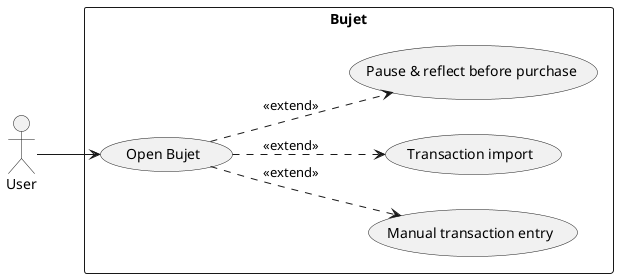
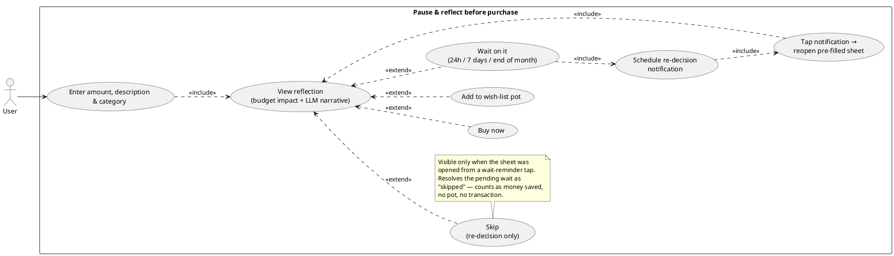
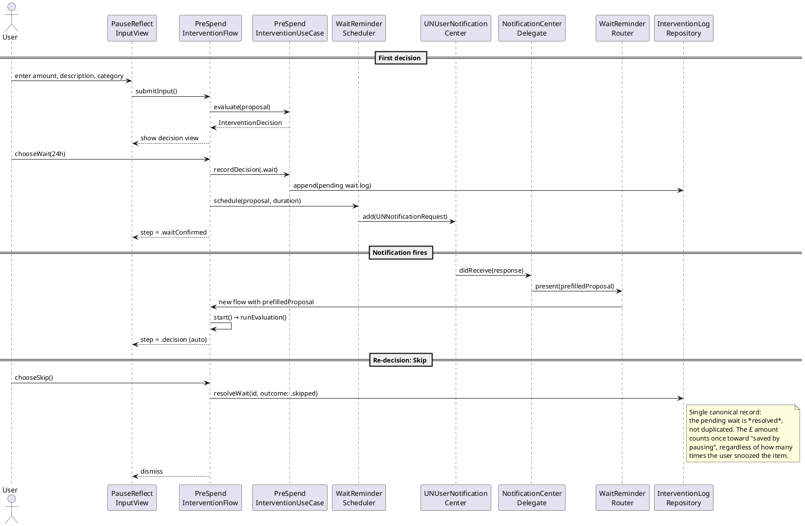

# CS6005 Portfolio — Sprint 3 (Innovative Feature) Update Plan

This document captures the changes needed to bring the portfolio in line with
the *actual* innovative feature that has been implemented in the codebase
(the Pause & Reflect notification → re-decision loop), and to remove the
stale "Insights / Review Spending" content that is currently sitting in the
Sprint 3 test cases.

---

## 1. Diagnosis of the current portfolio

Read of `CS6005_ Portfolio_ZACHARY_BECK.pdf`:

| Slide | Section | Status |
|---|---|---|
| 16 | §2.3.5 Sprint 3 shall-statements (S3.1 – S3.6) | **Already describe the innovative feature correctly.** S3.1 reflect sheet, S3.2 wait reminder with deep-link re-decision, S3.3 wish-list pot / skip, S3.4 single-record data integrity (NFR), S3.5 on-device LLM (NFR), S3.6 <100 ms pre-fill (NFR). |
| 18 | §2.3.6 Sprint 3 test cases (T3.1 – T3.8) | **Wrong.** Every test on this slide is for *Review Spending / Insights* (chart loading, filters, drill-down, VoiceOver on insights). None of them tests S3.1 – S3.6. This is the "insights stuff" to rip out. |
| 7 – 10 | §2.1 Use Case Diagrams | Main diagram + sub-diagrams already cover Pause & Reflect, Wait on it, Re-decision notification. **Two small fixes:** (a) the `Skip` action is missing from the diagram (it's mentioned in the use-case table but not drawn), (b) re-decision notification arrow can be drawn more clearly. |
| 17 | S3.4 description | Self-flagged: `// Need to look into this one more`. Needs a real description (see §3 below). |

So the work is narrow and well-defined: replace T3.1 – T3.8, redraw the
Pause-before-purchase use case diagram with `Skip`, and write S3.4 properly.

---

## 2. Updated use case diagrams (PlantUML)

Two diagrams change. Top-level diagram stays identical to what's currently
on slide 7 (it already only shows the three top-level use cases). The
**Pause-before-purchase** sub-diagram needs `Skip` added and the wait
durations matched to the code (`InterventionWaitDuration`).

### 2.1 Top-level use case diagram (unchanged — provided here for completeness)

### 2.2 Pause-before-purchase sub-diagram (updated — replaces current slide 10)

### 2.3 Optional new sequence diagram for §3.3 (PlantUML)

You currently have message-sequence diagrams for Connect-bank, Manual-add,
and Review-spending. The Review-spending one is dead weight if you're
removing the insights focus from Sprint 3. **Suggest replacing it with the
diagram below**, which shows the innovative loop end-to-end:

---

## 3. Replacement text for S3.4 description (slide 17)

Current text: *"// Need to look into this one more (not sure what it means)."*

Replace with:

> **S3.4: The app shall save the "Money saved" amount as a single canonical
> record, enhancing data integrity (NFR).**
>
> Description: Each "Wait on it" decision creates exactly one pending
> `InterventionLog` record, keyed by the original proposal ID. When the
> notification fires and the user re-decides, the existing record is
> *resolved* (`.purchased`, `.skipped`) rather than a new one being written.
> This guarantees that snoozing the same £35 jumper five times still
> contributes £35 to the "saved by pausing" total — not £175. The metric
> stays honest under repeated wait/snooze cycles.

This NFR is implemented in `PreSpendInterventionFlow.resolvePendingWait`
(`Features/PreSpendIntervention/PreSpendInterventionFlow.swift:291`) and
gated by `isRedecision` on `chooseBuyNow`, `chooseAddToPot`, `chooseSkip`,
and `chooseWait`.

---

## 4. Replacement Sprint 3 test cases (replaces T3.1 – T3.8 on slide 18)

Mapped 1:1 against S3.1 – S3.6. Each test is grounded in code that exists.

| Test ID | Feature ID & brief description | Input operations (sequence + data) | Expected output |
|---|---|---|---|
| **T3.1** | **S3.1** Pause & Reflect sheet opens and accepts a valid proposal. | 1) Launch app. 2) Tap "I'm about to spend…". 3) Enter Amount = `35`, Description = `Wool jumper`, Category = `Shopping`. 4) Tap **Reflect**. | Decision view appears showing: budget impact for Shopping, LLM-generated narrative paragraph, four-button choice (`Buy now`, `Wait on it`, `Add to Pot`, no `Skip` on first-decision). No `Skip` button visible (it's re-decision only). |
| **T3.2** | **S3.1** Validation — Reflect is disabled for zero / empty input (negative test). | 1) Tap "I'm about to spend…". 2) Leave amount blank (or `0`) and/or description blank. 3) Observe the Reflect button state. | `Reflect` button is disabled. If user forces submission, inline error appears ("Enter a valid amount." / "Add a short description.") and no decision view is shown. |
| **T3.3** | **S3.1** No-budget nudge fires when the chosen category has no limit set. | 1) Ensure no budget is set for `Shopping`. 2) Open the sheet, enter £35 / "Wool jumper" / Shopping. 3) Tap Reflect. | "Set a budget?" alert appears with two options: **Set a budget** (presents `BudgetsSheet` on top of the flow) and **Continue without budget** (proceeds to evaluation). Input is preserved across the alert. |
| **T3.4** | **S3.2** "Wait on it" schedules a local notification with the proposal encoded in `userInfo`. | 1) Complete T3.1 to land on the decision view. 2) Tap **Wait on it** → choose **24 hours**. 3) Inspect pending notifications (`UNUserNotificationCenter.getPendingNotificationRequests`) or wait for fire (DEBUG fires in ~5 s). | One `UNNotificationRequest` exists with identifier `wait-<proposalID>`. Its `userInfo` contains `kind = wait_reminder`, plus `proposalID`, `amount`, `itemDescription`, `category`, `currencyCode`. Title reads "Still want Wool jumper?". |
| **T3.5** | **S3.2** Tapping the wait-reminder banner deep-links into a pre-filled Pause & Reflect sheet sitting on the decision view. | 1) Complete T3.4 and background the app. 2) Wait for the banner to fire (~5 s in DEBUG). 3) Tap the banner. | App foregrounds; reflect sheet opens automatically; amount field shows `35`, description shows `Wool jumper`, category shows `Shopping`; the user lands directly on the decision view (input step is skipped); a **Skip** button is now visible alongside Buy now / Wait / Add to Pot. |
| **T3.6** | **S3.3** "Add to Pot" on the re-decision flow resolves the pending wait as `.skipped` and creates a wishlist pot (does **not** write a duplicate log). | 1) From the deep-linked re-decision sheet (T3.5), tap **Add to wish-list pot**. | A new `Goal` is created with `targetAmount = 35`, `linkedItem.createdFromIntervention = <proposalID>`. The original pending `InterventionLog` for that proposal moves to `outcome = .skipped`. No second log is appended. "Saved by pausing this month" increases by £35 (one record, not two). |
| **T3.7** | **S3.3** "Skip" on the re-decision flow resolves the pending wait as `.skipped` with no pot and no transaction. | 1) From the deep-linked re-decision sheet (T3.5), tap **Skip**. | Sheet dismisses. The pending `InterventionLog` for `<proposalID>` is now `.skipped`. No `Goal` exists for the item; no `Transaction` is written. "Saved by pausing this month" increases by £35. |
| **T3.8** | **S3.4** Repeated snoozing does **not** double-count toward "saved by pausing" (single-record data-integrity NFR). | 1) Complete T3.4 → T3.5 (1st re-decision). 2) On the re-decision sheet, tap **Wait on it** → 24 h. 3) When the banner fires again, tap it. 4) Tap **Skip**. | Across the whole sequence, exactly **one** `InterventionLog` exists for the proposal. Its final state is `.skipped`. "Saved by pausing this month" reflects £35, not £70. |
| **T3.9** | **S3.5** On-device LLM narrative — no proposal data leaves the device. | 1) Put the simulator into Airplane mode (or block network at the OS level). 2) Run T3.1 end-to-end. 3) Inspect the network traffic logs and the decision-view narrative paragraph. | A non-empty LLM narrative is rendered. Zero outbound network traffic during evaluation. If the on-device model fails to load (e.g., older simulator), the app falls back to hard-coded copy with the same numerical budget impact — sheet still renders, no crash. |
| **T3.10** | **S3.6** Notification → pre-fill latency under 100 ms (Apple HIG responsiveness). | 1) From a cold-start state, fire the wait banner (~5 s after Wait in DEBUG). 2) Tap the banner. 3) Use Instruments → Time Profiler / signposts around `WaitReminderRouter.present(_:)` and the `PreSpendInterventionFlow.init` that follows. | Time from `WaitReminderRouter` receiving the prefilled proposal to the decision view becoming visible is < 100 ms (excludes LLM evaluation, which runs after the sheet is on screen). No dropped frames during sheet presentation. |
| **T3.11** | **S3.2** Cold-start sheet-collision: banner tap during another modal sheet correctly defers and presents the reflect sheet. | 1) Open the Budgets sheet (any non-reflect modal). 2) Trigger the wait banner. 3) Tap the banner while the other sheet is on screen. | The other sheet is dismissed (or the reflect sheet is presented on top per the implementation in `MainTabView`), and the reflect sheet opens pre-filled with the proposal. No silent drop, no double-presentation crash. |

> **Note on table size:** the rubric only requires test cases that
> demonstrate coverage of the shall-statements. 11 tests across 6
> statements is generous; you can drop T3.11 or T3.9 if space is tight.

---

## 5. Slide-by-slide change list (what to actually edit in the .pptx)

1. **Slide 10** ("Pause before purchase" use case diagram) — redraw using
   the PlantUML in §2.2. Add the `Skip` use case + note.
2. **Slide 17** (Sprint 3 shall-statements) — replace S3.4 description with
   the text in §3.
3. **Slide 18** (Sprint 3 test cases) — delete the entire table, replace
   with the 9-to-11 row table in §4.
4. **Slide 23** (Review Spending sequence diagram) — *optional but
   recommended*: swap for the sequence diagram in §2.3 so your sequence
   diagrams cover all three Sprint features (Sprint 1 connect, Sprint 2
   manual add, Sprint 3 innovative loop). If you keep the Review Spending
   sequence diagram, the portfolio narrative becomes "Sprint 3 is insights"
   which contradicts S3.1 – S3.6.
5. **Slide 12** (Use case table for Pause & review) — already mentions the
   Skip alternative, but the wording `4iii(alt)` is slightly off. Suggest
   cleaning up to: *"Alternatives: 4iv: On a wait-reminder re-decision the
   sheet shows an additional `Skip` button which resolves the pending wait
   as 'skipped' without creating a pot or transaction."*

Sections 1, 2, 3 (project ideation, requirements, architecture intro) and
the Sprint 1 / Sprint 2 test cases are untouched.

---

## 6. Things I noticed but did **not** change (flagging for your call)

- **Class diagram (slide 21)** still shows `InsightService` / `InsightReport`
  / `ReviewSpendingViewModel`. Those classes exist in the code and are
  fine to keep, but they belong to the Insights tab, not the Sprint 3
  innovative feature. If you want the class diagram to reflect Sprint 3,
  add: `PreSpendInterventionFlow`, `PreSpendInterventionUseCase`,
  `WaitReminderScheduler`, `WaitReminderRouter`,
  `NotificationCenterDelegate`, `InterventionLogRepository`,
  `InterventionProposal`, `InterventionLog`, `Goal` / `WishlistItem`.
  Happy to draw this in PlantUML on request.
- **Detailed class descriptions (slide 24)** show
  `BankConnectionService` / `LocalTransactionRepository` /
  `ReviewSpendingViewModel`. The rubric requires "min 3 classes". Swapping
  `ReviewSpendingViewModel` out for `PreSpendInterventionFlow` would tie
  Section 3 directly to the innovative feature without dropping below the
  minimum.
- **Feature matrix (slide 6)** lists "Impulse spend notification &
  re-decision loop" against the competitors as a Bujet-only ✅. This is
  exactly the framing for the innovative feature and is already pulling
  its weight — keep as-is.
